# kottans-frontend

# Stage 0. Self-Study

## General
- [X] Git Basics
- [X] Linux CLI and Networking
- [X] Git for Team Collaboration
## Front-End Basics
- [X] Intro to HTML & CSS
- [X] Responsive Web Design
- [X] HTML & CSS Practice
- [X] JavaScript Basics
- [X] Document Object Model - practice
## Advanced Topics
- [X] Building a Tiny JS World (pre-OOP) - practice
- [X] Object oriented JS - practice
- [ ] OOP exercise - practice
- [ ] Offline Web Applications
- [ ] Memory pair game — real project!
- [ ] Website Performance Optimization
- [ ] Friends App - real project!

## Git Basics

#### What's New

- Using Git in terminal!
- Staging and working area.
- Pushing and pulling — that's so impressive!

## Linux CLI, and HTTP

#### What's New

- Arranged all the main commands in my heads.
- All about HTTP/S protocol.

    
Screenshots

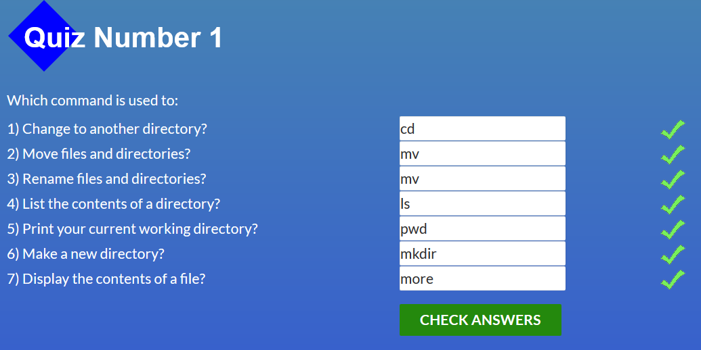
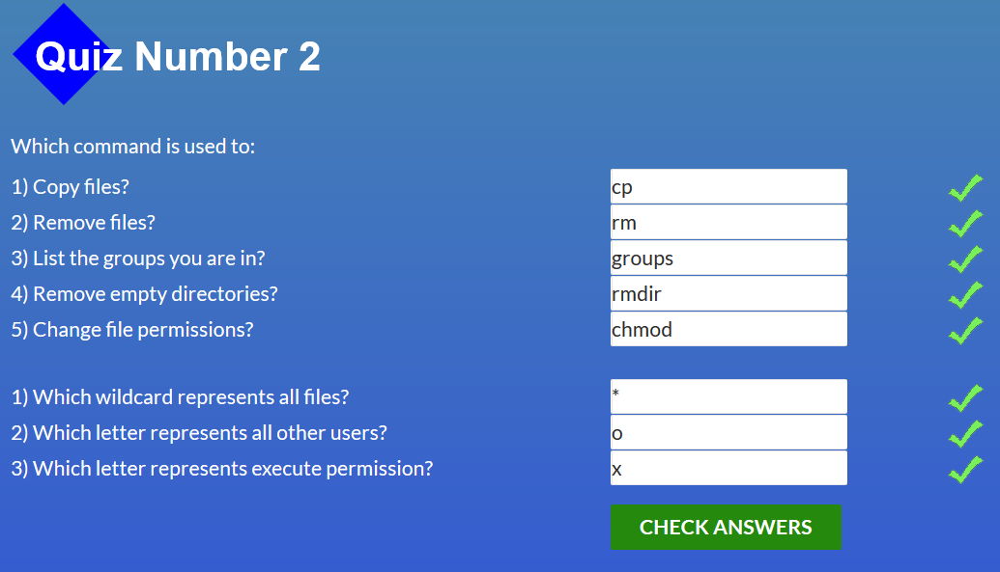
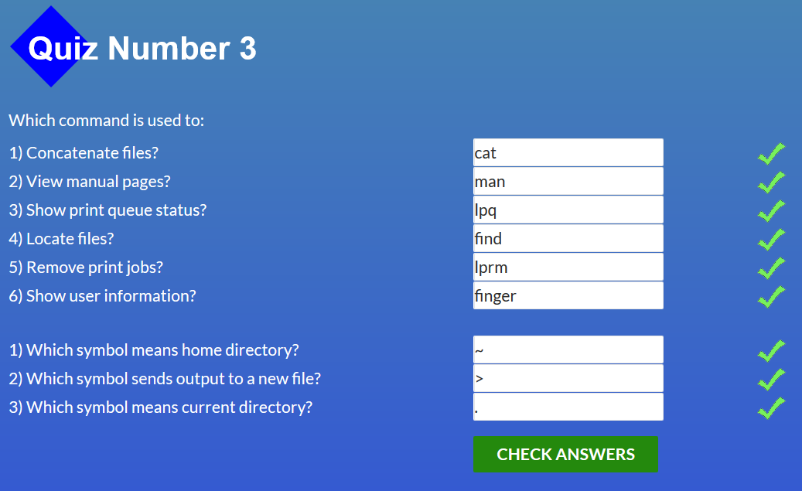
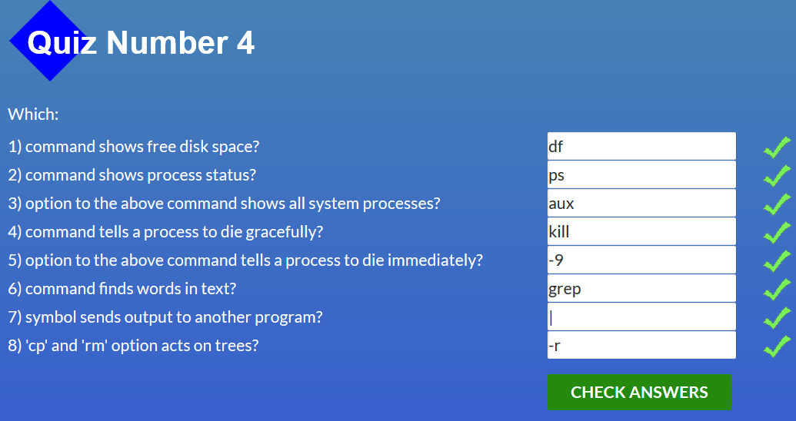

## Git for Team Collaboration

#### What's New
- Working with remote git (github).
- How cool is learngitbranching! Awesome education tool.

    
Screenshots

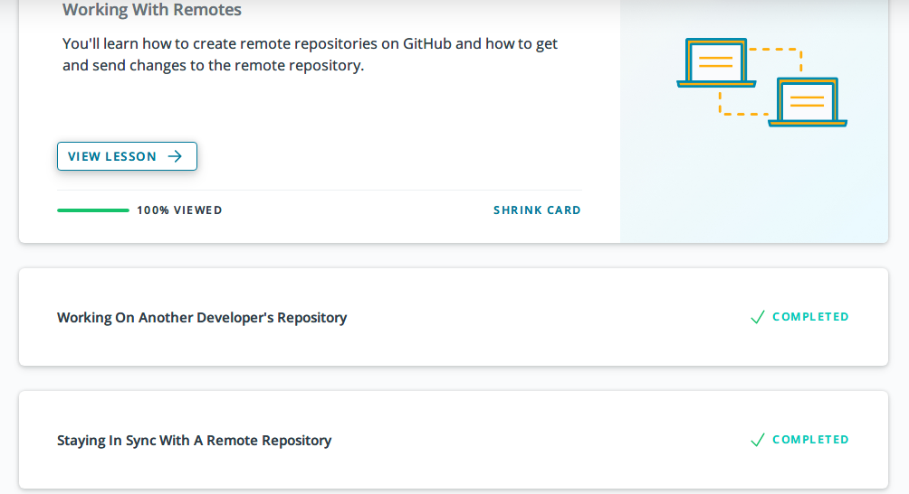
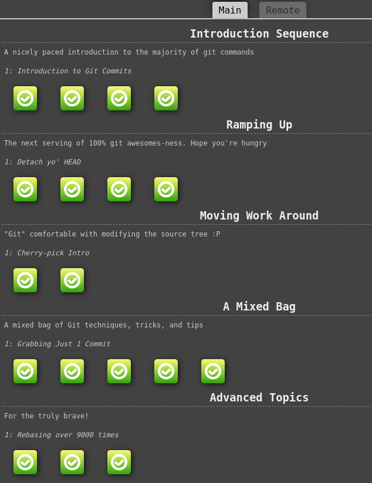
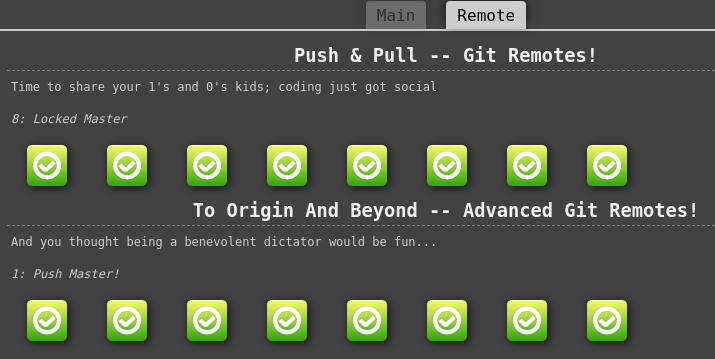

## Intro to HTML & CSS

#### What's New
- Repeated and consolidated knowledge about basic HTML and CSS.

    
Screenshots

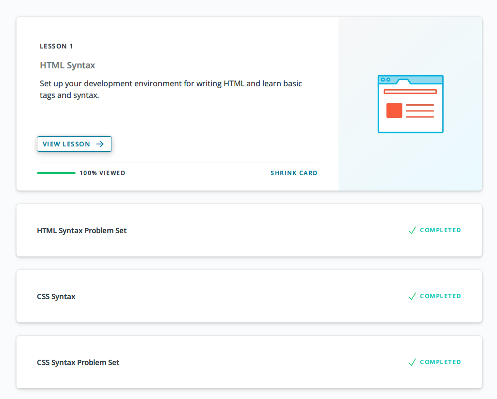
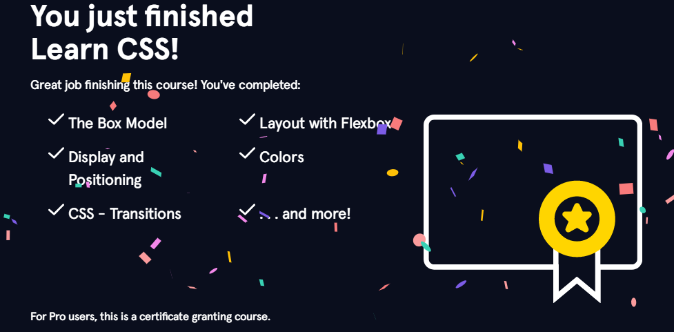
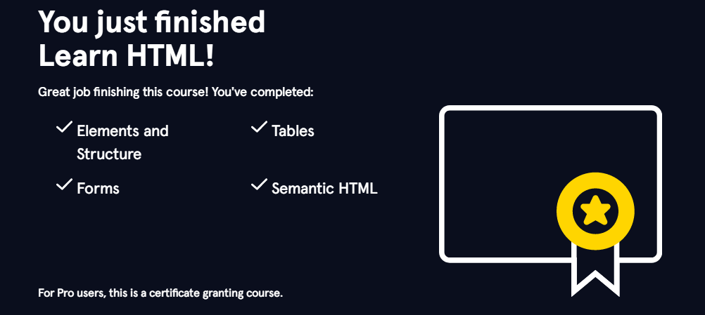

## Responsive Web Design

#### What's New
- Viewports and how to use them.
- Flexbox froggy is so cute game!

    
Screenshots

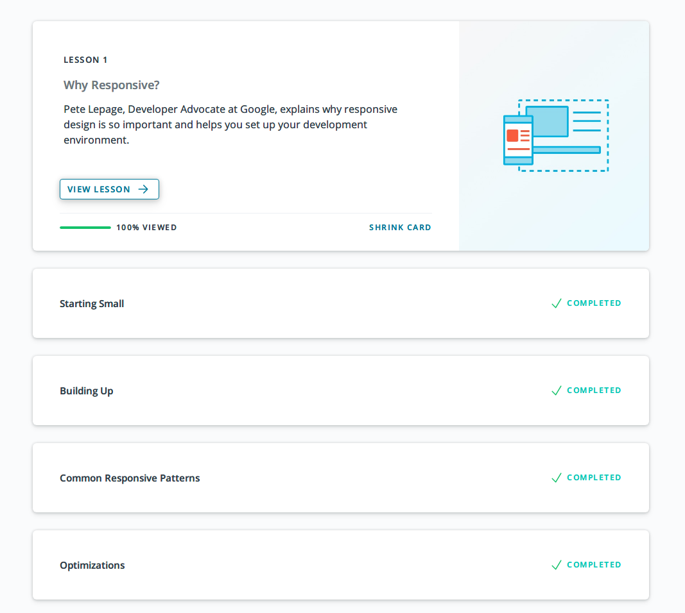
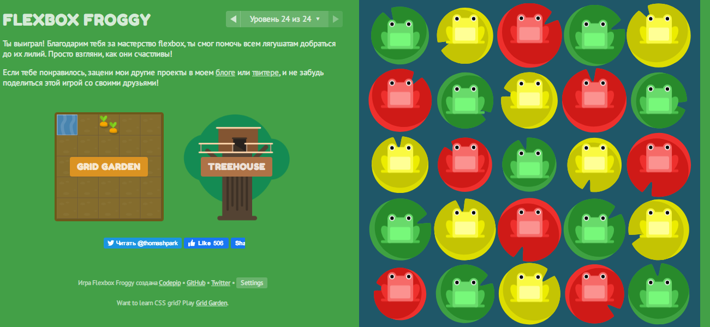

## HTML & CSS Practice

#### What's New
- That was excellent experience!
[Code](https://github.com/Jigsaff/html-css-popup)
[Demo](https://jigsaff.github.io/html-css-popup/)

## JavaScript Basics

#### What's New
- freeCodeCamp - the best place to study JS, enjoyed it a lot!

    
Screenshots

## Document Object Model - practice

#### What's New
- That was excellent experience!
[Code](https://github.com/Jigsaff/dom-api-task)
[Demo](https://jigsaff.github.io/dom-api-task/)

    
Screenshots

## Building a Tiny JS World (pre-OOP) - practice

#### What's New
- That was excellent experience!
[Code](https://github.com/Jigsaff/a-tiny-JS-world)
[Demo](https://jigsaff.github.io/a-tiny-JS-world/)

## Object oriented JS - practice

#### What's New
- Codewars - the place where code borns! Like it a lot!

    
Screenshots

